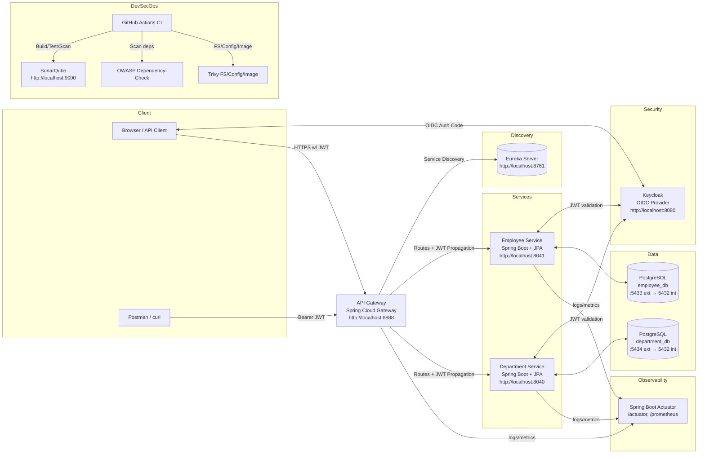

# Employee Management System (EMS)

A secure, observable, and DevSecOps‑enabled microservices system for managing employees and departments. The stack includes Spring Cloud Gateway, Eureka Discovery, Employee/Department microservices, Keycloak for OIDC, PostgreSQL databases, and an optional React frontend. Security, quality, and supply‑chain checks are integrated via SonarQube, OWASP Dependency‑Check, and Trivy.


## Table of Contents
1. Overview
2. Architecture (Mermaid diagram + explanation)
3. Backend Services
4. Security with Keycloak (OIDC/JWT)
5. Frontend (React)
6. Observability & Logging
7. How to Run Locally (Docker Compose)
8. DevSecOps: SonarQube, OWASP Dependency‑Check, Trivy, CI
9. Useful Endpoints & Ports
10. Troubleshooting & FAQ
11. Project Structure


## 1) Overview
- Gateway front door at `http://localhost:8888` authenticates users (OIDC) and authorizes requests (JWT), routing them to internal services.
- Services register with Eureka (`http://localhost:8761`) for client‑side discovery.
- Each service has its own PostgreSQL database for clear ownership and data isolation.
- Logs include `X-Correlation-Id` and `username` to trace a request across the system.
- DevSecOps tooling is available locally and in CI to keep code quality and security in check.


## 2) Architecture

### 2.1 Mermaid diagram (detailed)


### 2.2 How requests flow
1. A user authenticates with Keycloak (OIDC Authorization Code in the browser, or password grant for scripted demos).
2. The client sends requests to the Gateway with a Bearer token (JWT).
3. Gateway validates the JWT and routes requests to the target service discovered via Eureka.
4. Services also validate the JWT and process the request, persisting data in their own Postgres DBs.
5. Logs carry `X-Correlation-Id` and `username` for end‑to‑end tracing; Actuator exposes health/metrics.


## 3) Backend Services
- gateway-service (Spring Cloud Gateway, WebFlux)
  - Security: OAuth2 Client (for browser login) and Resource Server (JWT validation).
  - Responsibilities: routing, correlation ID injection, access logging.
- employee-service (Spring Boot + JPA)
  - Domain: CRUD over Employees (example endpoint: `GET /employee/api/employees`).
  - Security: Resource Server (JWT); access logging with correlation and user.
- department-service (Spring Boot + JPA)
  - Domain: CRUD over Departments (example endpoint: `GET /department/api/departments`).
  - Security: Resource Server (JWT); access logging with correlation and user.
- discovery-service (Eureka)
  - Central service registry used by Gateway and other services.

Notes
- Port mapping (host → container):
  - Gateway `8888 → 8888`
  - Eureka `8761 → 8761`
  - Employee `8041 → 8041`
  - Department `8040 → 8040`
  - Keycloak `8080 → 8080`
  - Postgres (employee) `5433 → 5432`, (department) `5434 → 5432`


## 4) Security with Keycloak (OIDC/JWT)
- Realm: `employee-realm` (imported by Docker at startup).
- OAuth2 client (Gateway):
  - `client_id`: `ems-api`
  - `client_secret`: configured in `gateway-service/src/main/resources/application.yml` (`spring.security.oauth2.client.registration.keycloak.client-secret`).
  - Scopes: `openid, profile, email`.
- Resource servers (Gateway and each backend):
  - `issuer-uri`: `http://localhost:8080/realms/employee-realm`
  - `jwk-set-uri`: `http://localhost:8080/realms/employee-realm/protocol/openid-connect/certs`
- Typical demo flow (scripted): obtain an access token via Keycloak token endpoint, then call Gateway endpoints with `Authorization: Bearer <token>`.

Security config references:
- See `gateway-service/src/main/resources/application.yml` → `spring.security.oauth2.*` for both client and resource server settings.


## 5) Frontend (React)
- Directory: `ems_frontend` (optional in this demo).
- Purpose: authenticate via Keycloak (OIDC), then call Gateway APIs with the acquired access token.
- If not demonstrating UI, you can use Postman or PowerShell `Invoke-WebRequest` to show the secured APIs instead.


## 6) Observability & Logging
- Actuator endpoints are exposed on all services under `/actuator` (health, info, metrics, loggers, prometheus).
- Log format includes correlation and username, for example in Gateway `application.yml`:

```
logging.pattern.console: "%d{yyyy-MM-dd HH:mm:ss.SSS} [%thread] %-5level [%X{correlationId}] [%X{username}] %logger{36} - %msg%n"
```

- Correlation handling: Gateway injects `X-Correlation-Id` when missing and propagates downstream; services include it in logs.


## 7) How to Run Locally (Docker Compose)
From project root (Windows/PowerShell):

```
docker compose up -d
```

Open UIs:
- Keycloak: `http://localhost:8080`
- Eureka: `http://localhost:8761`
- Gateway: `http://localhost:8888`
- Employee: `http://localhost:8041`
- Department: `http://localhost:8040`

Quick API smoke test (PowerShell):
```
$gw = "http://localhost:8888"
Invoke-WebRequest "$gw/employee/api/employees" -Method GET -SkipHttpErrorCheck -ErrorAction SilentlyContinue | Select-Object StatusCode
```
Expect 401 without a token. Obtain a token from Keycloak, then:
```
$token = "<access-token>"
$headers = @{ Authorization = "Bearer $token"; "X-Correlation-Id" = [guid]::NewGuid().ToString() }
Invoke-WebRequest "$gw/employee/api/employees" -Headers $headers -Method GET | Select-Object StatusCode, Content
```


## 8) DevSecOps: SonarQube, OWASP Dependency‑Check, Trivy, CI

### 8.1 SonarQube (static code analysis)
Start local Sonar:
```
docker compose -f docker-compose-sonarqube.yml up -d
```
Login at `http://localhost:9000` (admin/admin), create a token, then run:
```
./scripts/scan-sonar.ps1 -SonarHostUrl http://localhost:9000 -SonarToken <YOUR_TOKEN>
```

### 8.2 OWASP Dependency‑Check (dependency CVEs)
```
./scripts/scan-depcheck.ps1 -FailOnCVSS 7
```
Reports are generated in each module’s `target/` directory.

### 8.3 Trivy (containers & IaC)
```
# Filesystem scan
./scripts/scan-trivy.ps1 -Mode fs -Path .

# Config scan (Dockerfile/Compose)
./scripts/scan-trivy.ps1 -Mode config -Path .

# Optional image scan
# docker build -t ems-gateway ./gateway-service
# ./scripts/scan-trivy.ps1 -Mode image -ImageName ems-gateway:latest
```

### 8.4 CI Pipeline (GitHub Actions)
- Workflow executes build + tests, Dependency‑Check, Sonar (if token provided), and Trivy FS/Config scans.
- Findings can be reviewed in SonarQube dashboard and the repository’s Security tab.


## 9) Useful Endpoints & Ports
- Gateway base: `http://localhost:8888`
  - Example: `GET /employee/api/employees`, `GET /department/api/departments`
- Actuator examples:
  - Gateway: `http://localhost:8888/actuator/health`
  - Employee: `http://localhost:8041/actuator/health`
  - Department: `http://localhost:8040/actuator/health`
- Keycloak realm certs (for JWT validation):
  - `http://localhost:8080/realms/employee-realm/protocol/openid-connect/certs`


## 10) Troubleshooting & FAQ
- 401 errors:
  - Ensure your token is from realm `employee-realm`, audience includes `ems-api`, and it’s not expired.
- Services not in Eureka:
  - Give 1–2 minutes after `docker compose up -d`, then refresh `http://localhost:8761`.
- Port conflicts:
  - Change published ports in `docker-compose.yml` or stop conflicting services.
- Database connectivity:
  - Check health of `employee-db` (`5433`) and `department-db` (`5434`); verify credentials in each service’s `application.yml`.
- Logs missing correlation or username:
  - Send/propagate `X-Correlation-Id` and ensure requests are authenticated.


## 11) Project Structure
- `gateway-service`: Spring Cloud Gateway (WebFlux), OAuth2 client/resource server, correlation/access logging
- `employee-service`: Spring Boot REST + JPA, OAuth2 resource server, access logging
- `department-service`: Spring Boot REST + JPA, OAuth2 resource server, access logging
- `discovery-service`: Eureka server
- `ems_frontend`: React client
- `docker-compose.yml`: Full local stack (Keycloak, Postgres, services)
- `docker-compose-sonarqube.yml`: Local SonarQube stack
- `docs/`: Architecture and diagrams (Mermaid)
- `scripts/`: PowerShell helper scripts (Sonar, Dependency‑Check, Trivy)


Notes
- Logging files inside containers go to `/app/logs/*.log`; mount volumes in `docker-compose.yml` if you want to persist them.
- Ensure Keycloak client and issuer settings match `application.yml` values across services.
